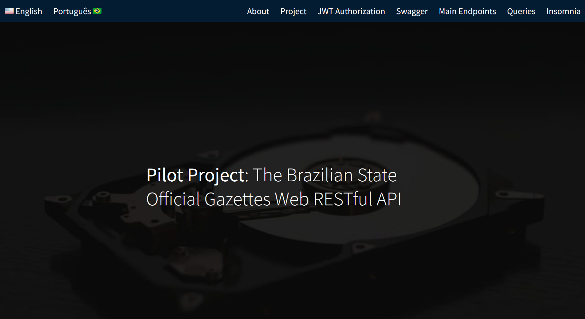
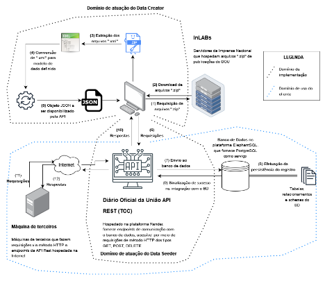

_[English](README.md)/Português._
# Diário Oficial da União Web Restful API
https://dou-rest-api.onrender.com

## Sobre

Bem-vindo à página inicial do projeto piloto Diário Oficial da União (DOU) Web Restful API e a página inicial do projeto (landing-page).

Esta API foi desenvolvida como parte do Trabalho de Conclusão de Curso (TCC) em Sistemas de Informação na Universidade Federal de Santa Catarina (UFSC). O projeto foi implementado no semestre 2023.2 e supervisionado pelo [Prof. José Eduardo De Lucca](https://www.linkedin.com/in/delucca).

## Visão Geral do Projeto

O Diário Oficial da União (DOU) serve como meio oficial de comunicação do Estado brasileiro com seus nacionais e partes interessadas, estabelecido em 1862. Tradicionalmente impresso pela Imprensa Nacional, o DOU passou por uma transformação em 2017, tornando-se totalmente digitalizado e acessível apenas online.

Este trabalho concentra-se em um estudo de caso que captura dados dos DOUs entre 2020-2022. O projeto oferece acessibilidade por meio de uma Web Restful API usando o framework Swagger para documentação. Devido a **limitações técnicas e ao uso de recursos gratuitos**, este projeto piloto não pôde abranger toda a temporalidade de dois anos. Assim, o escopo temporal foi reduzido para 3 dias de dados: 1, 4 e 5 de setembro de 2023, servindo como uma **prova de conceito inicial** para demonstrar não apenas a funcionalidade, mas também o potencial do projeto e sua **escalabilidade**.

Para este projeto, um modelo de dados foi desenvolvido para extrair informações sobre signatários de documentos em um artigo DOU, o tipo de sua publicação (despacho, portaria, etc.), categoria principal (ministério, secretaria, etc.), data de publicação e mais.

## Tecnologias Utilizadas

* Python
* Javascript
* CSS
* HTML
* Flask
* Flask Smorest
* Flask Migrate
* Flask JWT Extended
* SQLAlchemy
* Marshmallow
* GUnicorn
* Psycopg2
* PostgreSQL
* Passlib

O projeto foi principalmente desenvolvido em **Python**. A página inicial, sua estrutura e estilo, foram feitos em **HTML** e **CSS**. Algum **Javascript** foi usado para adicionar a funcionalidade de mudança de idiomas.

A API foi criada com **Flask**, um microframework web para Python que fornece recursos essenciais para construir aplicações web. A extensão **Smorest** do Flask adiciona suporte para construir APIs Restful, pois fornece recursos adicionais para criar uma API bem estruturada e documentada usando o padrão **OpenAPI**.

A extensão **Migrate** do Flask lidou com as migrações de banco de dados usando o SQLAlchemy e simplificou o processo de atualização dos esquemas do banco de dados à medida que o projeto evoluía. A extensão **Flask-JWT-Extended** para **JSON Web Tokens** (JWT) permitiu a proteção de rotas e recursos verificando JWTs, com um mecanismo para autenticação e autorização de usuários.

O **SQLAlchemy** também foi usado, pois é uma caixa de ferramentas SQL e uma biblioteca de **Object-Relational-Mapping (ORM)** para Python. Ele forneceu um conjunto de APIs de alto nível para interagir com bancos de dados relacionais, permitindo o trabalho com objetos Python. O **Marshmallow** foi utilizado para converter tipos de dados complexos, como objetos, para e de JSON.

O **Psycopg2** é um adaptador **PostgreSQL** para Python, pois permite que aplicações Python interajam com bancos de dados PostgreSQL. O **Passlib** é uma biblioteca de hash de senhas para Python. O servidor utilizado foi o **GUnicorn** (Green Unicorn), porque é um servidor WSGI leve e pronto para produção para executar aplicações web Python no Render, comumente usado para servir aplicações Flask em ambiente de produção.

Essas bibliotecas são comumente usadas juntas em aplicações Flask para construir APIs web com autenticação segura, interagir com bancos de dados, lidar com migrações e serializar/desserializar dados.

## Objetivos da Pesquisa

A proposta de pesquisa tinha como objetivo demonstrar a possibilidade de tornar dados abertos acessíveis a pesquisadores e partes interessadas para análise de dados em larga escala. Recursos-chave da API incluem:

- Captura de dados DOU de 3 dias
- Acessibilidade por meio de uma Web Restful API
- Documentação usando o framework Swagger
- Consulta ao banco de dados para análise de dados
- Funcionalidade de pesquisa baseada em critérios temporais, categoria, tipo de matéria, número de "artigo" e assinantes de artigos.

## Como Começar

Para explorar a API e sua documentação, visite [Diário Oficial da União Web Restful API Documentation](https://dou-rest-api.onrender.com/swagger-ui).

## Mais Informações e Contato

- **Repositório:** [DOU REST API](https://www.github.com/barbaracalderon/dou-rest-api)
- **Trabalho de Conclusão de Curso:** [Repositório UFSC](https://repositorio.ufsc.br/bitstream/handle/123456789/253322/TCC%20-%20Barbara%20Calderon.pdf?sequence=1&isAllowed=y)
- **Linkedin:** [Barbara Calderon](https://www.linkedin.com/in/barbaracalderondev)

Sinta-se à vontade para explorar, contribuir e utilizar a Diário Oficial da União Web Restful API para suas pesquisas e necessidades de análise de dados.
