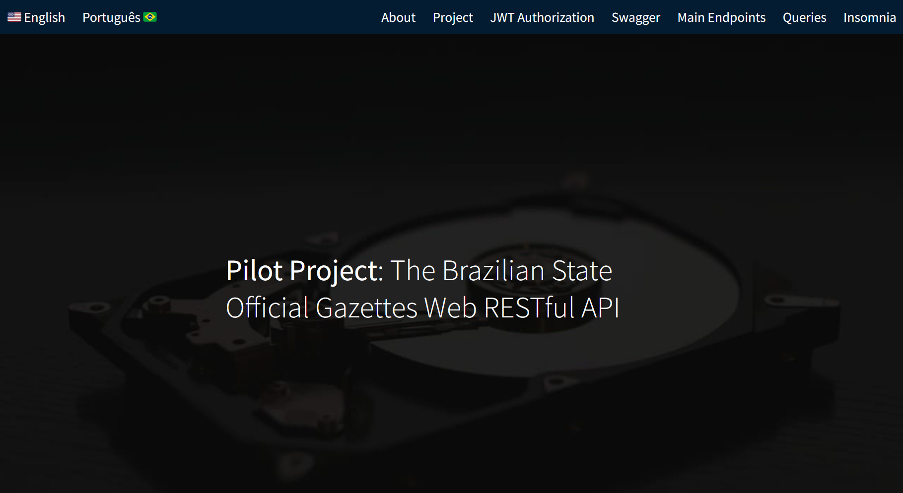

_English/Português._

# Diário Oficial da União Web Restful API
https://dou-rest-api.onrender.com

## About

Welcome to the landing page for the Diário Oficial da União (DOU) Web Restful API.

This API was developed as part of the Undergraduate Thesis (TCC) in Information Systems at the Federal University of Santa Catarina (UFSC). The project was implemented in the semester 2023.2 and supervised by Prof. José Eduardo De Lucca.

## Project Overview

The Diário Oficial da União (DOU) serves as an official communication medium of the Brazilian state to its nationals and interested parties, established in 1862. Traditionally printed by the National Press, the DOU underwent a transformation in 2017, becoming fully digitized and accessible only online.

This work focuses on a case study capturing data from DOUs between 2020-2022. The project provides accessibility through a Web Restful API using the Swagger framework for documentation. Due to **technical limitations and the use of free resources**, this pilot project could not meet the two-year temporality. Thus, the temporal scope was reduced to 3 days of data: September 1, 4, and 5, year 2023, serving as an **initial proof of concept** to demonstrate not only the functionality but also the potential of the project and its **scalability**.

For this project, a data model was developed to extract information about signers of documents in a DOU article, the type of its publication (dispatch, ordinance, etc.), main category (ministry, secretariat, etc.), publication date, and more.

## Techs Used

* Flask
* Flask Smorest
* Flask Migrate
* Flask JWT Extended
* SQLAlchemy
* Marshmallow
* GUnicorn
* Psycopg2
* PostgreSQL
* Passlib

The API was created with **Flask**, a micro web framework for Python that provides essentials for building web applications. The **Smorest** extension of Flask adds a support building Restful APIs because it provides additional features for creating a well-structured and documented API using the **OpenAPI standard**.  

The **Migrate** extension of Flask handled the database migrations using SQLAlchemy and it simplified the process of updating database schemas as the project evolved. The **Flask-JWT-Extended** extension for **JSON Web Tokens** (JWT) allowed the protection of routes and resources by verifying JWTs, with a mechanism for user authentication and authorization.

**SQLAlchemy** was also used as it is an SQL toolkit and **Object-Relational-Mapping (ORM)** library for Python. It provided a set of high-level API for interacting with relational databases allowing the work with Python objects. **Marshmallow** was used to convert complex data types, such as objects, to and from JSON.

**Psycopg2** is a **PostgreSQL** adapter for Python as it enables Python applications to interact with PostgreSQL databases. **Passlib** is a password hashing library for Python. The server used was **GUnicorn** (Green Unicorn) because it's a lightweight, production-ready WSGI server for running Python web applications on Render, commonly used to serve Flask applications in production environment.

These libraries are commonly used together in Flask applications to build web APIs with secure authentication, interact with databases, handle migrations, and serialize/deserialize data.

## Research Objectives

The research proposal aimed to demonstrate the possibility of making open data accessible to researchers and interested parties for large-scale data analysis. Key features of the API include:

- Capture of 3 day DOU data 
- Accessibility through a Web Restful API
- Documentation using the Swagger framework
- Querying the database for data analysis
- Search functionality based on temporal criteria, category, type of matter, number of "article," and subscribers to articles.

## Getting Started

To explore the API and its documentation, visit [Diário Oficial da União Web Restful API Documentation](https://dou-rest-api.onrender.com/swagger-ui).

## More Information and Contact

- **Repository:** [DOU REST API](https://www.github.com/barbaracalderon/dou-rest-api)
- **Bachelor Thesis:** [UFSC Repositório](https://repositorio.ufsc.br/bitstream/handle/123456789/253322/TCC%20-%20Barbara%20Calderon.pdf?sequence=1&isAllowed=y)
- **Linkedin:** [Barbara Calderon](https://www.linkedin.com/in/barbaracalderondev)

Feel free to explore, contribute, and utilize the Diário Oficial da União Web Restful API for your research and data analysis needs.

# Diário Oficial da União Web Restful API
https://dou-rest-api.onrender.com

## Sobre

Bem-vindo à página inicial do projeto piloto Diário Oficial da União (DOU) Web Restful API.

Esta API foi desenvolvida como parte do Trabalho de Conclusão de Curso (TCC) em Sistemas de Informação na Universidade Federal de Santa Catarina (UFSC). O projeto foi implementado no semestre 2023.2 e supervisionado pelo Prof. José Eduardo De Lucca.

## Visão Geral do Projeto

O Diário Oficial da União (DOU) serve como meio oficial de comunicação do Estado brasileiro com seus nacionais e partes interessadas, estabelecido em 1862. Tradicionalmente impresso pela Imprensa Nacional, o DOU passou por uma transformação em 2017, tornando-se totalmente digitalizado e acessível apenas online.

Este trabalho concentra-se em um estudo de caso que captura dados dos DOUs entre 2020-2022. O projeto oferece acessibilidade por meio de uma Web Restful API usando o framework Swagger para documentação. Devido a **limitações técnicas e ao uso de recursos gratuitos**, este projeto piloto não pôde abranger toda a temporalidade de dois anos. Assim, o escopo temporal foi reduzido para 3 dias de dados: 1, 4 e 5 de setembro de 2023, servindo como uma **prova de conceito inicial** para demonstrar não apenas a funcionalidade, mas também o potencial do projeto e sua **escalabilidade**.

Para este projeto, um modelo de dados foi desenvolvido para extrair informações sobre signatários de documentos em um artigo DOU, o tipo de sua publicação (despacho, portaria, etc.), categoria principal (ministério, secretaria, etc.), data de publicação e mais.

## Tecnologias Utilizadas

* Flask
* Flask Smorest
* Flask Migrate
* Flask JWT Extended
* SQLAlchemy
* Marshmallow
* GUnicorn
* Psycopg2
* PostgreSQL
* Passlib

A API foi criada com **Flask**, um microframework web para Python que fornece o essencial para a construção de aplicações web. A extensão **Smorest** do Flask adiciona suporte para a construção de APIs Restful, pois oferece recursos adicionais para criar uma API bem estruturada e documentada usando o padrão **OpenAPI**.

A extensão **Migrate** do Flask gerenciou as migrações de banco de dados usando SQLAlchemy e simplificou o processo de atualização dos esquemas do banco de dados conforme o projeto evoluía. A extensão **Flask-JWT-Extended** para **JSON Web Tokens** (JWT) permitiu a proteção de rotas e recursos verificando JWTs, com um mecanismo para autenticação e autorização de usuários.

**SQLAlchemy** também foi utilizado, sendo um toolkit SQL e biblioteca de **Object-Relational-Mapping (ORM)** para Python. Ele forneceu um conjunto de API de alto nível para interagir com bancos de dados relacionais, permitindo o trabalho com objetos Python. **Marshmallow** foi usado para converter tipos de dados complexos, como objetos, para e de JSON.

**Psycopg2** é um adaptador **PostgreSQL** para Python, permitindo que aplicações Python interajam com bancos de dados PostgreSQL. **Passlib** é uma biblioteca de hash de senha para Python. O servidor utilizado foi o **GUnicorn** (Green Unicorn) por ser um servidor WSGI leve e pronto para produção, utilizado comumente para servir aplicações Flask em ambiente de produção no Render.

Essas bibliotecas são comumente usadas juntas em aplicações Flask para construir APIs web com autenticação segura, interagir com bancos de dados, lidar com migrações e serializar/deserializar dados.

## Objetivos da Pesquisa

A proposta de pesquisa tinha como objetivo demonstrar a possibilidade de tornar dados abertos acessíveis a pesquisadores e partes interessadas para análise de dados em larga escala. Recursos-chave da API incluem:

- Captura de dados DOU de 3 dias
- Acessibilidade por meio de uma Web Restful API
- Documentação usando o framework Swagger
- Consulta ao banco de dados para análise de dados
- Funcionalidade de pesquisa baseada em critérios temporais, categoria, tipo de matéria, número de "artigo" e assinantes de artigos.

## Como Começar

Para explorar a API e sua documentação, visite [Diário Oficial da União Web Restful API Documentation](https://dou-rest-api.onrender.com/swagger-ui).

## Mais Informações e Contato

- **Repositório:** [DOU REST API](https://www.github.com/barbaracalderon/dou-rest-api)
- **Trabalho de Conclusão de Curso:** [Repositório UFSC](https://repositorio.ufsc.br/bitstream/handle/123456789/253322/TCC%20-%20Barbara%20Calderon.pdf?sequence=1&isAllowed=y)
- **Linkedin:** [Barbara Calderon](https://www.linkedin.com/in/barbaracalderondev)

Sinta-se à vontade para explorar, contribuir e utilizar a Diário Oficial da União Web Restful API para suas pesquisas e necessidades de análise de dados.
