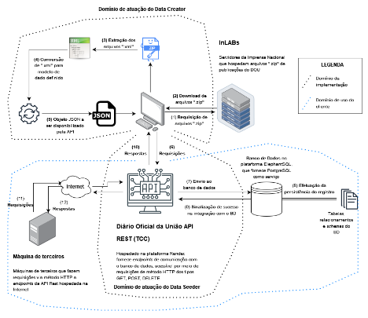

_English/[Português](LEIAME.md)._

# Diário Oficial da União Web Restful API
https://dou-rest-api.onrender.com

## About

Welcome to the repository that hosts the API and its landing page for the project **Diário Oficial da União (DOU) Web Restful API**.

This API was developed as part of the Undergraduate Thesis (TCC) in Information Systems at the Federal University of Santa Catarina (UFSC). The project was implemented in the semester 2023.2 and supervised by [Prof. José Eduardo De Lucca](https://www.linkedin.com/in/delucca).

_PS: Unlike the version in the thesis, this API version adopts JSON Web Tokens (JWT) as an authentication and authorization mechanism._

## Project Overview

The Diário Oficial da União (DOU) serves as an official communication medium of the Brazilian state to its nationals and interested parties, established in 1862. Traditionally printed by the National Press, the DOU underwent a transformation in 2017, becoming fully digitized and accessible only online.

This work focuses on a case study capturing data from DOUs between 2020-2022. The project provides accessibility through a Web Restful API using the Swagger framework for documentation. Due to **technical limitations and the use of free resources**, this pilot project could not meet the two-year temporality. Thus, the temporal scope was reduced to 3 days of data: September 1, 4, and 5, year 2023, serving as an **initial proof of concept** to demonstrate not only the functionality but also the potential of the project and its **scalability**.

For this project, a data model was developed to extract information about signers of documents in a DOU article, the type of its publication (dispatch, ordinance, etc.), main category (ministry, secretariat, etc.), publication date, and more.

## Research Objectives

The research proposal aimed to demonstrate the possibility of making open data accessible to researchers and interested parties for large-scale data analysis. Key features of the API include:

- Capture of 3 day DOU data 
- Accessibility through a Web Restful API
- Documentation using the Swagger framework
- Querying the database for data analysis
- Search functionality based on temporal criteria, category, type of matter, number of "article," and subscribers to articles.

## Information and Contact

- **API URL:** [https://dou-rest-api.onrender.com/](https://dou-rest-api.onrender.com/)
- **Github Repo:** [https://github.com/barbaracalderon/dou-rest-api](https://github.com/barbaracalderon/dou-rest-api)
- **Bachelor Thesis PDF:** [UFSC Repositório](https://repositorio.ufsc.br/bitstream/handle/123456789/253322/TCC%20-%20Barbara%20Calderon.pdf?sequence=1&isAllowed=y)
- **Author Linkedin:** [Barbara Calderon](https://www.linkedin.com/in/barbaracalderondev)

## Techs Used

* Python
* Javascript
* CSS
* HTML
* Flask
* Flask Smorest
* Flask Migrate
* Flask JWT Extended
* SQLAlchemy
* Marshmallow
* GUnicorn
* Psycopg2
* PostgreSQL
* Passlib

The project was mainly developed in **Python**. The landing page, its structure and style, was done in **HTML** and **CSS**. Some **Javascript** was used to add the changing languages functionality.

The API was created with **Flask**, a micro web framework for Python that provides essentials for building web applications. The **Smorest** extension of Flask adds a support building Restful APIs because it provides additional features for creating a well-structured and documented API using the **OpenAPI standard**.  

The **Migrate** extension of Flask handled the database migrations using SQLAlchemy and it simplified the process of updating database schemas as the project evolved. The **Flask-JWT-Extended** extension for **JSON Web Tokens** (JWT) allowed the protection of routes and resources by verifying JWTs, with a mechanism for user authentication and authorization.

**SQLAlchemy** was also used as it is an SQL toolkit and **Object-Relational-Mapping (ORM)** library for Python. It provided a set of high-level API for interacting with relational databases allowing the work with Python objects. **Marshmallow** was used to convert complex data types, such as objects, to and from JSON.

**Psycopg2** is a **PostgreSQL** adapter for Python as it enables Python applications to interact with PostgreSQL databases. **Passlib** is a password hashing library for Python. The server used was **GUnicorn** (Green Unicorn) because it's a lightweight, production-ready WSGI server for running Python web applications on Render, commonly used to serve Flask applications in production environment.

These libraries are commonly used together in Flask applications to build web APIs with secure authentication, interact with databases, handle migrations, and serialize/deserialize data.

### Deploy

- Render
- ElephantSQL
- Start.sh
- Requirements.txt
- WSGI.py

The project deployment was carried out on the [Render](https://render.com/) platform, using a free account as a "Web Service." In addition to configuring environment variables, the `requirements.txt` file was created, serving as a build command, and the `start.sh` script was developed, serving as a start command. 

The database is hosted on the [ElephantSQL](https://www.elephantsql.com/) platform, also on a free account with limited space. This platform provides cloud-based PostgreSQL database hosting services.

Finally, `WSGI` (Web Server Gateway Interface) was employed for communication between the web server and the Python application.

## Getting Started

To explore the API and its documentation, visit [Diário Oficial da União Web Restful API Documentation](https://dou-rest-api.onrender.com/swagger-ui).

Feel free to explore, contribute, and utilize the Diário Oficial da União Web Restful API for your research and data analysis needs.